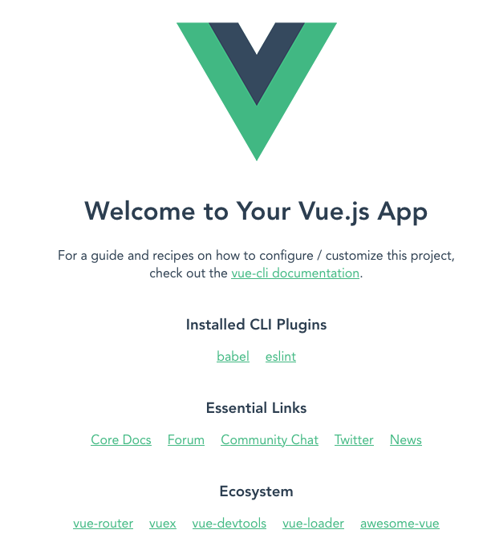

# VueCLI4 でGoogleAppsScript アプリを作成する

GoogleAppsScript (以下GAS) で簡易なWeb サイトやアプリケーションが作成できるのですが、  
それをVueCLI を用いて作成してみました。  

## Vue CLI のインストール

Vue.js のアプリケーションを簡単に作るためのCLI ツールであるVue CLI をインストールします。  
Vue CLI はglobal install する必要があるので注意。  

なおnpm を使用する場合は適宜読み替えてください。  
```
$ yarn global add @vue/cli @vue/cli-init
yarn global v1.22.10
[1/4] 🔍  Resolving packages...
[2/4] 🚚  Fetching packages...
[3/4] 🔗  Linking dependencies...
[4/4] 🔨  Building fresh packages...
success Installed "@vue/cli@4.5.11" with binaries:
      - vue
✨  Done in 197.86s.

$ vue --version
@vue/cli 4.5.11
```
* vue が動かない場合はグローバルインストールしたパッケージへのパスが通っていないと思われます。必要に応じてググってみてください。  


## プロジェクトを作成

プロジェクト内にすべてのソースコードが入ります。  

```
$ vue create <appname>
* ここではappname は"vue-gas-app" とします。
** おそらくself singed certificate に関するエラーが生じるので、Global Protect を一時的に切断しましょう。
*** 終了後再接続するのを忘れずに。
```

実行後、以下の初期設定用インタラクティブモードに入ります。  
今回は試しにManual で設定してみましょう。 
```
Vue CLI v4.5.11
? Please pick a preset: (Use arrow keys)
  Default ([Vue 2] babel, eslint)
  Default (Vue 3 Preview) ([Vue 3] babel, eslint)
❯Manually select features

↓

? Check the features needed for your project: (Press <space> to select, <a> to toggle all, <i> to invert selection)
❯◉ Choose Vue version
 ◉ Babel
 ◯ TypeScript
 ◯ Progressive Web App (PWA) Support
 ◯ Router
 ◯ Vuex
 ◯ CSS Pre-processors
 ◉ Linter / Formatter
 ◯ Unit Testing
 ◯ E2E Testing

↓

? Choose a version of Vue.js that you want to start the project with
❯ 2.x
  3.x (Preview)

↓

? Pick a linter / formatter config:
  ESLint with error prevention only
  ESLint + Airbnb config
  ESLint + Standard config
❯ ESLint + Prettier

↓

? Pick additional lint features: (Press <space> to select, <a> to toggle all, <i> to invert selection)
❯◉ Lint on save
 ◯ Lint and fix on commit

↓

? Where do you prefer placing config for Babel, ESLint, etc.? (Use arrow keys)
❯ In dedicated config files
  In package.json

↓

? Save this as a preset for future projects? (y/N) n

↓

? Pick the package manager to use when installing dependencies: (Use arrow keys)
❯ Use Yarn
  Use NPM

↓

✨  Creating project in /Users/user/work/vue-gas-app.
🗃  Initializing git repository...
⚙️  Installing CLI plugins. This might take a while...

yarn install v1.22.10
info No lockfile found.
[1/4] 🔍  Resolving packages...
[2/4] 🚚  Fetching packages...
[3/4] 🔗  Linking dependencies...
[4/4] 🔨  Building fresh packages...
success Saved lockfile.
✨  Done in 123.97s.
🚀  Invoking generators...
📦  Installing additional dependencies...

yarn install v1.22.10
[1/4] 🔍  Resolving packages...
[2/4] 🚚  Fetching packages...
[3/4] 🔗  Linking dependencies...
[4/4] 🔨  Building fresh packages...

success Saved lockfile.
✨  Done in 20.69s.
⚓  Running completion hooks...

📄  Generating README.md...

🎉  Successfully created project vue-gas-app.
👉  Get started with the following commands:

 $ cd vue-gas-app
 $ yarn serve
```

今回は単純なビューのみのアプリを作成するので、Vue Router やVuex は使用しないものとします。    
パッケージのインストールが完了したら試しに一度動かしてみましょう。    

```
$ cd vue-app-demo

$ yarn serve
```




## GoogleAppsScript の用意

以下のリンクからGoogle Apps Script API を｢オン｣にし、新しいプロジェクトを作成しましょう。
[https://script.google.com/u/1/home/usersettings]


## clasp 

```
$ clasp login

$ clasp create vue-gas-app
? Create which script?
  standalone
  docs
  sheets
  slides
  forms
❯ webapp
  api

↓

Created new webapp script: https://script.google.com/d/<id>/edit
Warning: files in subfolder are not accounted for unless you set a '.claspignore' file.
Cloned 1 file.
└─ appsscript.json
```

ここで新たにappsscript.json と.clasp.json が作成されます。  
最終的にGAS へは`clasp push` というコマンドでdist/ 内のファイルをアップロードするのですが、  
dist/ 内にappsscript.json やCode.js を配置することを避けるために、gas/ というディレクトリを作成しましょう。  

```
$ mkdir gas

$ mv appsscript.json gas/

$ echo .clasp.json >> .gitignore
```

またgas/ 内にGAS のエントリポイントとなるCode.js を作成します。  

```javascript
# Code.js
function doGet() {
  return getHtml()
}
function getHtml() {
  const html = HtmlService.createTemplateFromFile('index')
  return html
    .evaluate()
    .setTitle('vue-gas-app')
    .addMetaTag('viewport', 'width=device-width, initial-scale=1')
}
```

dist/ 内のファイルをGAS へpush するために.clasp.json を以下のように修正します。  

```json
{
  "scriptId":"<id>",
  "rootDir": "dist"
}
```

## ビルドの設定

作成したgas/ 内のファイルをビルドの際にdist/ にコピーしてくれるように、webpack の設定をします。  
VueCLI では従来のようにwebpack.config.js に設定するのではなく、vue.config.js 内に記述します。  

```javascript
# vue.config.js
const CopyWebpackPlugin = require('copy-webpack-plugin')

module.exports = {
  configureWebpack: {
    plugins: [
      new CopyWebpackPlugin([
        {
          from: path.resolve(__dirname, './gas'),
          ignore: ['.*']
        }
      ])
    ]
  }
};
```

また、VueCLI の通常のバンドルではGAS では読み込めない場合があるため、すべてをインラインでバンドルすることにします。

```javascript
# vue.config.js
const path = require('path')
const CopyWebpackPlugin = require('copy-webpack-plugin')
const HtmlWebpackInlineSourcePlugin = require('html-webpack-inline-source-plugin')

module.exports = {
  publicPath: '/public',
  chainWebpack: config => {
    config
      .plugin('html')
      .tap(args => {
        args[0].template = './public/index.html'
        args[0].inlineSource = '.(vue|js|css)'
        return args
      })
  },
  configureWebpack: {
    plugins: [
      new HtmlWebpackInlineSourcePlugin(),
      new CopyWebpackPlugin([
        {
          from: path.resolve(__dirname, './gas'),
          ignore: ['.*']
        }
      ])
    ]
  }
};
```

## deploy

では実際にビルドしてみましょう。  

```
$ yarn build
```

ビルドしたものをclasp push でデプロイします。  
また、不要なファイルがアップロードされないように事前に.claspignore を設定します。  

```
/* .claspignore */
**/**
static/**
static/css/**
!appsscript.json
!Code.js
!index.html
```

```
$ clasp push
```

## Appendix

### Linter とFormatter

Linting rules に関しては好みが分かれますが、ここでは標準的に使用されているPrettier をフォーマッタに使用します。  
VueCLI を使用してESLint + Prettier をインストールすると、自動的にESLint とPrettier で競合するルールをオフにしてくれる`eslint-config-prettier` がインストールされるので、基本的には自分で特にルールをいじる必要はありません。  
私の場合は .prettierrc.js にてシングルクォートのみ有効にしてあります。  

```javascript
# .prettierrc.js
module.exports = {
  singleQuote: true,
};
```
